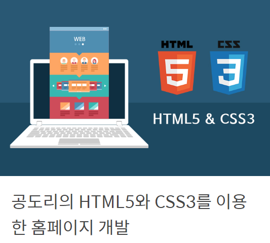

# 수강 목록

인프런[[바로가기](https://www.inflearn.com/)] 에서 공부 하고 있는 강의를 정리하였습니다.   

  
    

## 수강 완료

   
### [강의 바로가기](https://www.inflearn.com/course/html-css-sucademy/#)  
[수카데미](https://www.sucademy.com/)

---

## 진행중

 
 ###  [강의 바로가기](https://www.inflearn.com/course/%EC%A0%9C%EC%A3%BC%EC%BD%94%EB%94%A9-%EC%9B%B9%EA%B0%9C%EB%B0%9C-30%EB%B6%84%EC%9A%94%EC%95%BD/#)     
[제주코딩베이스캠프](http://www.jejucodingcamp.com/)

 

---

### [강의 바로가기](https://www.inflearn.com/course/html-css-sucademy/#)   
[리베하얀 블로그](http://www.jejucodingcamp.com/)

 

---

  
### [강의 바로가기](https://www.inflearn.com/course/html-css-%EA%B0%95%EC%A2%8C-codesquad#) 
[코드스쿼드](https://codesquad.kr/)

 

---

## 진행 예정

 
### [강의 바로가기](https://www.inflearn.com/course/html5/#)  
[공도리TV](https://www.youtube.com/channel/UCUiLDqX0HPE0AUeieMEb2-g)

 

---

  
### [강의 바로가기](https://www.inflearn.com/course/html-css-%EA%B0%95%EC%A2%8C/#) 
[Seoul Wiz]()

 

---

  
### [강의 바로가기](https://www.inflearn.com/course/javascript-%EC%9E%90%EB%B0%94%EC%8A%A4%ED%81%AC%EB%A6%BD%ED%8A%B8-codesquad-masters_lv1#)(유료) 
[코드스쿼드](https://codesquad.kr/)

